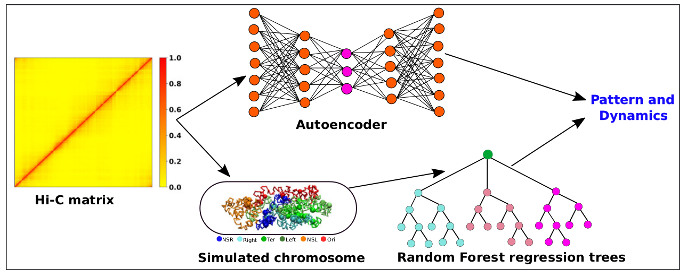

## Welcome to the repository for the research project titled **\textcolor{blue}{Machine learning unravels inherent structural patterns in Escherichia coli Hi-C matrices and predicts chromosome dynamics}**
## Machine learning unravels inherent structural patterns in Escherichia coli Hi-C matrices and predicts chromosome dynamics

# Abstract
High dimensional nature of the chromosomal conformation contact map (‘Hi-C Map’), even for microscopically small bacterial cell, poses challenges for extracting meaningful information related to its complex organization. Here we first demonstrate that an artificial deep neural network-based machine-learnt (ML) low-dimensional representation of a recently reported Hi-C interaction map of archetypal bacteria Escherichia coli can decode crucial underlying structural pattern. The ML-derived representation of Hi-C map can automatically detect a set of spatially distinct domains across E. coli genome, sharing reminiscences of six putative macro-domains previously posited via recombination assay. Subsequently, a ML-generated model assimilates the intricate relationship between large array of Hi-C-derived chromosomal contact probabilities and respective diffusive dynamics of each individual chromosomal gene and identifies an optimal number of functionally important chromosomal contact-pairs that are majorly responsible for heterogenous, coordinate-dependent sub-diffusive motions of chromosomal loci. Finally, the ML models, trained on wild-type E. coli show-cased its predictive capabilities on mutant bacterial strains, shedding light on the structural and dynamic nuances of $\Delta$MatP30MM and $\Delta$MukBEF22MM chromosomes. Overall our results illuminate the power of ML techniques in unraveling the complex relationship between structure and dynamics of bacterial chromosomal loci, promising meaningful connections between ML-derived insights and biological phenomena.

# Graphical abstract.

We first employ an artificial neural network (ANN) based frame-work known as Autoencoder, in a bid to uncover crucial structural insights embedded within this large Hi-C matrix. Autoencoder is an unsupervised machine learning algorithm. It consists of an encoder and a decoder and in between there is a bottleneck. The encoder transforms high-dimensional input data to a lower-dimensional latent space, while the decoder reconstructs the initial input data from the latent space. We integrate Hi-C contacts into a polymer-based model, predicting diffusive dynamics of a large number of chromosomal loci using a supervised machine learning technique called Random Forest (RF) regression. Random Forest Regression to extract dynamical information by leveraging the structural properties of the chromosome, such as the pairwise distance between chromosomal beads.

# Code Requirements

Ensure you have the following Python packages installed to run the code:

1. [numpy](https://numpy.org/)
2. [tensorflow](https://www.tensorflow.org/)
3. [scikit-learn](https://scikit-learn.org/stable/)

## Structure Folder

Inside the **structure** folder, you'll find three subfolders containing Autoencoder scripts:
### Autoencoder Scripts

1. **wt30MM/autoencoder_Hic.py**
   - Python script to train the autoencoder for wild-type Hi-C matrix.

2. **delmatp30MM/predicted_from_wt30MM_training/auto_delta_matp.py**
   - Python script to recreate the Hi-C matrix for the $\Delta$ MatP mutant using a trained model on WT30MM data.

3. **delmukbf22MM/predicted_from_wt30MM_training/auto_delta_mukbf.py**
   - Python script to recreate the Hi-C matrix for the $\Delta$ MukBEF mutant using a trained model on WT30MM data.

## Dynamics Folder
Within the **dynamics** folder, you'll find three subfolders containing Random Forest Regression scripts:
### Random Forest regression Scripts

1. **wt30mm/hic_random_forest.py**
   - Python scripts for training and predicting the dynamics of wild-type chromosomes.

2. **delmatp30MM/hic_random_forest_predict_delmatp.py**
   - Python scripts to predict the dynamics for the $\Delta$ MatP mutant using a trained model on WT30MM data.

3. **delmukbf22MM/hic_random_forest_predict_delmukbef.py**
   - Python scripts to predict the dynamics for the $\Delta$ MukBEF mutant using a trained model on WT30MM data.
  
   
## News!  
We are thrilled to announce that our work has been published in **Nucleic Acids Research**! You can explore the full article [here](https://academic.oup.com/nar/advance-article/doi/10.1093/nar/gkae749/7747202). This publication highlights our latest research on decoding the structure and dynamics of bacterial chromosomes using machine learning approaches. Stay tuned for more exciting developments!

## Citation

If you use this code, please cite the following paper:

@article{bera2024machine,
  title={Machine learning unravels inherent structural patterns in Escherichia coli Hi-C matrices and predicts chromosome dynamics},
  author={Bera, Palash and Mondal, Jagannath},
  journal={Nucleic Acids Research},
  volume={52},
  number={18},
  pages={10836--10849},
  year={2024},
  publisher={Oxford University Press}
}

